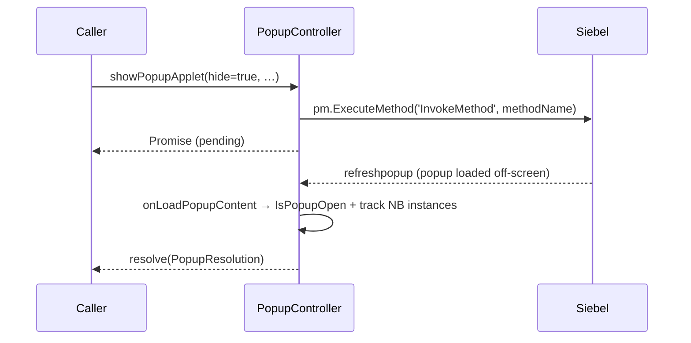

# PopupController

`PopupController` is the process-wide singleton that coordinates Siebel popups (MVG, pick,
association, export). Ported call-for-call from the legacy `NexusPopupController`, it hooks Siebel's
`ProcessNewPopup` and the `refreshpopup` / `refreshview` events so a popup can be opened, optionally
**hidden**, and surfaced to the caller as a `Promise`.

It is the **highest-risk module** in the bridge: the `ProcessNewPopup` monkey-patch and the
`reInitPopupPM` PM-lifecycle dance are deeply Siebel-version-sensitive and are copied exactly, comments
and all.

```ts
import { PopupController } from 'siebel-connect'

const controller = PopupController.instance // Symbol-enforced singleton; `new` throws
```

The constructor (run once, on first `instance` access) resolves the Siebel constants, performs the
first-load `Setup()` of the popup PM if needed, installs the `ProcessNewPopup` wrapper (stashing the
original on `SiebelAppFacade.NexusProcessNewPopup`), and registers the `refreshpopup` / `refreshview`
event listeners.

## The hide / resolve flow

When a popup is opened with `hide = true`, the controller parks a `resolve` function and returns a
promise. Siebel loads the popup off-screen and fires `refreshpopup`; `onLoadPopupContent` then finds
the open applet(s), tracks the matching bridge instances from `SiebelAppFacade.NB`, and resolves the
promise with a [`PopupResolution`](./types.md).



## Methods

| Method | Description |
| ------ | ----------- |
| `PopupController.instance` | The singleton (lazily constructed). |
| `PopupController.IsPopupOpen()` | `PopupOpenState`: whether a popup is open, and the applet(s) in `currPopups` (`0` = MVG, `1` = association). |
| `canOpenPopup()` | `false` while a popup promise is pending (a popup is already opening). |
| `showPopupApplet(hide, cb, nb, methodName, ps?)` | Invoke `methodName` on `nb` to open a popup; when `hide`, returns a promise resolving on load (rejects if the invoke returns `false`). |
| `showExportApplet(hide, cb, nb)` | Open the export-query popup via the `CommandManager`. |
| `_openAssocApplet(hide, newRecordFunc, cb?)` | Open an association applet around a new-record call. |
| `closePopupApplet(nb?)` | Close the popup (defaults to the tracked one). Throws `MethodNotSupportedError` if `CloseApplet` can't be invoked, `PopupError` if there's nothing to close. |
| `checkOpenedPopup(closeIfOpen?)` | Report whether a popup is open, optionally closing it first. |
| `gotoView(ctx, func, viewName, appletName?, id?)` | Run a navigation `func` and resolve when `refreshview` reports the target view. |
| `processNewPopup(ps)` | The `ProcessNewPopup` hook body: marks the popup visible and rewrites its URL. |
| `reInitPopupPM()` | The `EndLife → constructor → Init → Setup` PM-reinitialisation dance (clears stale bindings/DOM). |

## What changed in the port

Behaviour is identical to `NexusPopupController`. The tracked instances, the resolve payload, and the
`IsPopupOpen` result are typed; string throws became [`ConnectError`](./errors.md) subclasses with the
**exact** original messages (`MethodNotSupportedError` for the `CloseApplet` guard, `PopupError` for
the "not opened by NB" / "not found in OnLoadPopupContent" cases); and `console.log/warn` route
through the debug-gated [logger](./logging.md). The Symbol-enforced singleton is preserved.
