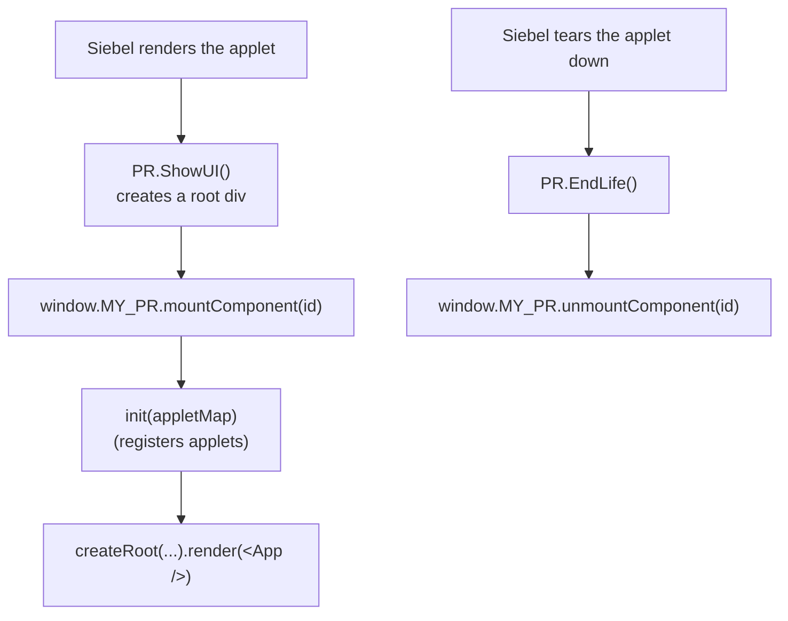

# Siebel setup (the PR)

Before `siebel-connect` can reach an applet, Siebel has to load your React bundle and hand control to
it. That handoff happens in a **Physical Renderer (PR)**: a small Siebel JavaScript class that Siebel
instantiates for an applet, and whose lifecycle you hook into to mount and unmount React.

This page covers the full registration flow:

1. [Build your React app as an IIFE](#1-build-your-react-app-as-an-iife) so Siebel can load it.
2. [Write the Physical Renderer](#2-write-the-physical-renderer) that mounts and unmounts React.
3. [Map your applets and call `init`](#3-map-your-applets-and-call-init) from the React entry point.
4. [Register the PR on the applet](#4-register-the-pr-on-the-applet) in Siebel Tools / Web Templates.



## 1. Build your React app as an IIFE

Siebel's AMD loader (`define()`) can only consume a single pre-built IIFE bundle: no ESM, no code
splitting, no dynamic imports. With Vite:

```ts
// vite.config.ts
import { defineConfig } from 'vite'
import react from '@vitejs/plugin-react'

export default defineConfig({
  plugins: [react()],
  build: {
    outDir: 'build',
    rollupOptions: {
      input: './src/index.tsx',
      output: {
        manualChunks: undefined,
        inlineDynamicImports: true,
        format: 'iife', // required: Siebel cannot load ESM/CJS
        entryFileNames: 'main.js',
      },
    },
  },
})
```

The bundle (`build/main.js`) is what the PR loads as a dependency.

## 2. Write the Physical Renderer

The PR extends `SiebelAppFacade.PhysicalRenderer`. Mount React in `ShowUI`, tear it down in `EndLife`,
and always call the `superclass` methods so Siebel's own event and data wiring still runs.

```js
// MY_APPLET_PR.js
define('siebel/custom/my_widget/MY_APPLET_PR', [
  'siebel/custom/my_widget/build/main', // your React IIFE bundle
], function () {
  SiebelAppFacade.MY_APPLET_PR = (function () {
    const containerId = 'my-react-root'

    function MY_APPLET_PR() {
      SiebelAppFacade.MY_APPLET_PR.superclass.constructor.apply(this, arguments)
    }
    SiebelJS.Extend(MY_APPLET_PR, SiebelAppFacade.PhysicalRenderer)

    MY_APPLET_PR.prototype.Init = function () {
      SiebelAppFacade.MY_APPLET_PR.superclass.Init.apply(this, arguments)
    }

    MY_APPLET_PR.prototype.ShowUI = function () {
      SiebelAppFacade.MY_APPLET_PR.superclass.ShowUI.apply(this, arguments)
      // Prefer GetFullId() over a hardcoded selector like "#_svf0".
      const appletEl = document.getElementById(this.GetPM().Get('GetFullId'))
      const root = document.createElement('div')
      root.id = containerId
      appletEl.appendChild(root)
      window.MY_APPLET_PR.mountComponent(containerId)
    }

    MY_APPLET_PR.prototype.BindEvents = function () {
      SiebelAppFacade.MY_APPLET_PR.superclass.BindEvents.apply(this, arguments)
    }

    MY_APPLET_PR.prototype.EndLife = function () {
      const el = document.getElementById(containerId)
      if (el) {
        window.MY_APPLET_PR.unmountComponent(containerId)
        el.remove()
      }
      SiebelAppFacade.MY_APPLET_PR.superclass.EndLife.apply(this, arguments)
    }

    return MY_APPLET_PR
  })()
  return 'SiebelAppFacade.MY_APPLET_PR'
})
```

> Use `this.GetPM().Get('GetFullId')` to find the applet's DOM node. A hardcoded id breaks when the
> same view is reused or Siebel renumbers its elements. Give each PR a unique `containerId`.

## 3. Map your applets and call `init`

The React entry point exposes `mountComponent` / `unmountComponent` on `window`, and calls
[`init`](./init/) **before** rendering so the applet instances exist when your components run.

`init` takes your **applet map**: registry keys on the left, the exact **Siebel applet names** on the
right. This is the single place that "registers" the applets `siebel-connect` will expose. The keys are
what you pass to `getApplet` / `getPopup` everywhere else, and what your types attach to.

```ts
// src/config/appletMap.ts
export const appletMap = {
  accountList: 'Account List Applet', // a key -> the Siebel applet name from your view
  accountForm: 'Account Entry Applet',
  contactsMvg: 'Account Contact Mvg Applet', // a popup applet (MVG / pick / assoc)
} as const
```

```tsx
// src/index.tsx
import { createRoot, type Root } from 'react-dom/client'
import { init, configure } from 'siebel-connect'
import { appletMap } from './config/appletMap'
import App from './App'

let root: Root | null = null

const mountComponent = (id: string) => {
  configure({ debug: import.meta.env.DEV }) // optional: route diagnostics through your logger
  init(appletMap) // register the applets BEFORE rendering
  const container = document.getElementById(id)!
  root = createRoot(container)
  root.render(<App />)
}

const unmountComponent = (_id: string) => {
  root?.unmount()
  root = null
}

window.MY_APPLET_PR = { mountComponent, unmountComponent }
```

Declare the `window` member so TypeScript is happy:

```ts
// src/types/siebel.d.ts
declare global {
  interface Window {
    MY_APPLET_PR: {
      mountComponent: (id: string) => void
      unmountComponent: (id: string) => void
    }
  }
}
export {}
```

> `init` is **destructive**: each call drops every previously memoized applet before rebuilding, so
> calling it once per mount is correct. See [Initialising the factory](./init/) for the details.

## 4. Register the PR on the applet

Tell Siebel to use your PR for the applet. In Siebel Tools (or the Manifest Administration view), bind
the applet's renderer to your PR module name (`siebel/custom/my_widget/MY_APPLET_PR`) and add the PR
file plus the `build/main.js` bundle to the manifest for that applet or view. The exact steps follow
your standard Open UI manifest workflow and are unchanged from a plain Nexus Bridge deployment.

## Next

- [Type your applets](./typing/) so `getApplet('accountList')` returns `Applet<Account>`.
- [Initialise the factory](./init/) and read your first records in the [Quick start](./quick-start/).
- Develop without a server using the [mock Siebel harness](../testing/), then ship with
  [Building & deploying](../guides/deployment/).
