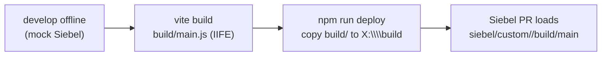

# Building & deploying

The development loop ends by getting your built React bundle onto the Siebel server, where the
[Physical Renderer](../getting-started/siebel-setup.md) loads it. This page covers the build and an
**automated deploy** for the common case where the Siebel server's web root is reachable as a shared
network drive.



## 1. Build the IIFE

Use the [Vite IIFE config](../getting-started/siebel-setup.md#1-build-your-react-app-as-an-iife). The
build emits `build/main.js`, the single bundle the PR depends on:

```bash
npm run build   # vite build -> build/main.js
```

## 2. Make the server reachable as a drive

Map the Siebel server's custom web folder to a drive letter (here `X:`). On Windows this is a standard
mapped network drive to the share that backs the Open UI `PUBLIC` custom path, for example:

```
X:\  ->  \\<siebel-host>\...\PUBLIC\<lang>\<build>\siebel\custom
```

Each deployable app lives in its own folder under that share (`X:\<folder>\build`), which is exactly the
path the PR references in its `define(...)` dependency
(`siebel/custom/<folder>/build/main`). The deploy script below copies your local `build/` into that
folder.

## 3. The deploy script

Add this as `scripts/deploy.ts` in your **consuming app** (it deploys that app's `build/`, not the
`siebel-connect` library). It lists the target folder's current contents, asks for confirmation, then
copies `build/` over the shared drive.

Install the script's dependencies:

```bash
npm install -D tsx inquirer chalk ora @types/node
```

Wire up an npm script:

```json
{
  "scripts": {
    "deploy": "tsx scripts/deploy.ts"
  }
}
```

```ts
// scripts/deploy.ts
/// <reference types="node" />

import fs from "fs";
import path from "path";

import inquirer from "inquirer";
import chalk from "chalk";
import ora from "ora";

interface DeployConfig {
    directoryPath: string;
    buildFolder: string;
    sourceFile: string;
    targetFile: string;
}

class DeployCLI {
    private config: DeployConfig;

    constructor() {
        this.config = {
            directoryPath: 'X:\\',
            buildFolder: 'build',
            sourceFile: 'main.js',
            targetFile: 'main.js'
        };
    }

    async start(): Promise<void> {
        console.log(chalk.blue.bold('\n🚀 Siebel Custom Dashboard Deploy Tool\n'));

        try {
            // Get directory input from CLI
            await this.getDirectoryInput();

            // List files in the directory
            await this.listDirectoryFiles();

            // Show confirmation prompt with arrow navigation
            const confirmed = await this.showConfirmationPrompt();

            if (confirmed) await this.copyFile();
            else console.log(chalk.yellow('\n❌ Deployment cancelled by user.\n'));

        } catch (error) {
            console.error(chalk.red('\n💥 An error occurred:'), error);
            process.exit(1);
        }
    }

    private async getDirectoryInput(): Promise<void> {
        // Check if directory path was provided as command line argument
        const args = process.argv.slice(2);

        if (args.length > 0) {
            // Use the first argument as the directory path
            const inputPath = args[0];
            this.config.directoryPath = `x:\\${inputPath}/build`;
            console.log(chalk.green(`✓ Target directory set from argument: ${this.config.directoryPath}`));
        } else {
            // Fall back to interactive prompt if no argument provided
            const answers = await inquirer.prompt([
                {
                    type: 'input',
                    name: 'directoryPath',
                    message: chalk.cyan('Enter the target directory path:'),
                    default: 'your_folder_name',
                    validate: (input: string) => {
                        if (!input.trim()) {
                            return 'Directory path cannot be empty';
                        }
                        return true;
                    }
                }
            ]);

            this.config.directoryPath = `x:\\${answers.directoryPath}/build`;
            console.log(chalk.green(`✓ Target directory set to: ${this.config.directoryPath}`));
        }
    }

    private async listDirectoryFiles(): Promise<void> {
        const spinner = ora('Reading directory contents...').start();

        try {
            const fullPath = this.config.directoryPath;

            // Check if directory exists
            if (!fs.existsSync(fullPath)) {
                spinner.fail(`Directory not found: ${fullPath} `);
                throw new Error(`Directory not found: ${fullPath} `);
            }

            const files = fs.readdirSync(fullPath);
            spinner.succeed('Directory contents loaded');

            // Display files in a nice format
            console.log(chalk.blue('\n📁 Current files in directory:'));
            console.log(chalk.gray('─'.repeat(50)));

            if (files.length === 0) {
                console.log(chalk.yellow('  (empty directory)'));
            } else {
                files.forEach((file) => {
                    const filePath = path.join(fullPath, file);
                    const stats = fs.statSync(filePath);
                    const isDirectory = stats.isDirectory();
                    const icon = isDirectory ? '📁' : '📄';
                    const size = isDirectory ? '' : ` (${this.formatFileSize(stats.size)})`;

                    console.log(chalk.white(`  ${icon} ${file}${size} `));
                });
            }

            console.log(chalk.gray('─'.repeat(50)));
            console.log(chalk.blue(`Total items: ${files.length} `));

        } catch (error) {
            spinner.fail('Failed to read directory');
            throw error;
        }
    }

    private async showConfirmationPrompt(): Promise<boolean> {
        const answers = await inquirer.prompt([
            {
                type: 'select',
                name: 'confirm',
                message: chalk.yellow('Do you want to continue with the deployment?'),
                choices: [
                    {
                        name: chalk.green('✅ Yes, deploy the file'),
                        value: true
                    },
                    {
                        name: chalk.red('❌ No, cancel deployment'),
                        value: false
                    }
                ],
                default: 0 // Default to "Yes"
            }
        ]);

        return answers.confirm;
    }

    private async copyFile(): Promise<void> {
        // const sourcePath = path.join(this.config.buildFolder, this.config.sourceFile);
        // const targetPath = path.join(this.config.directoryPath, this.config.targetFile);
        const sourcePath = path.join(this.config.buildFolder);
        const targetPath = path.join(this.config.directoryPath);

        // Check if source file exists
        if (!fs.existsSync(sourcePath)) {
            throw new Error(`Source file not found: ${sourcePath} `);
        }

        const spinner = ora('Copying file...').start();

        try {
            // Create target directory if it doesn't exist
            const targetDir = path.dirname(targetPath);
            if (!fs.existsSync(targetDir)) {
                fs.mkdirSync(targetDir, { recursive: true });
            }

            // Copy the file
            fs.cpSync(sourcePath, targetPath, { recursive: true });

            spinner.succeed(chalk.green('File copied successfully!'));

            // Show file details
            const stats = fs.statSync(targetPath);
            console.log(chalk.blue('\n📋 Deployment Summary:'));
            console.log(chalk.gray('─'.repeat(40)));
            console.log(chalk.white(`Source: ${sourcePath} `));
            console.log(chalk.white(`Target: ${targetPath} `));
            console.log(chalk.white(`Size: ${this.formatFileSize(stats.size)} `));
            console.log(chalk.white(`Modified: ${stats.mtime.toLocaleString()} `));
            console.log(chalk.gray('─'.repeat(40)));
            console.log(chalk.green.bold('\n🎉 Deployment completed successfully!\n'));

        } catch (error) {
            spinner.fail('Failed to copy file');
            throw error;
        }
    }

    private formatFileSize(bytes: number): string {
        const sizes = ['Bytes', 'KB', 'MB', 'GB'];
        if (bytes === 0) return '0 Bytes';
        const i = Math.floor(Math.log(bytes) / Math.log(1024));
        return Math.round(bytes / Math.pow(1024, i) * 100) / 100 + ' ' + sizes[i];
    }
}

// Main execution
async function main(): Promise<void> {
    const args = process.argv.slice(2);

    // Show help if --help or -h is provided
    if (args.includes('--help') || args.includes('-h')) {
        console.log(chalk.blue.bold('\n🚀 Siebel Custom Dashboard Deploy Tool\n'));
        console.log(chalk.white('Usage:'));
        console.log(chalk.gray('  npm run deploy [folder_name]'));
        console.log(chalk.gray('  tsx scripts/deploy.ts [folder_name]'));
        console.log(chalk.gray('  node deploy.js [folder_name]\n'));
        console.log(chalk.white('Examples:'));
        console.log(chalk.gray('  npm run deploy my_project'));
        console.log(chalk.gray('  npm run deploy test_folder'));
        console.log(chalk.gray('  npm run deploy  # Interactive mode\n'));
        console.log(chalk.white('Options:'));
        console.log(chalk.gray('  --help, -h     Show this help message'));
        console.log(chalk.gray('  [folder_name]  Target folder name (optional)\n'));
        console.log(chalk.yellow('Note: If no folder name is provided, the tool will run in interactive mode.\n'));
        return;
    }

    const deployCLI = new DeployCLI();
    await deployCLI.start();
}

// Run the CLI application
main().catch((error) => {
    console.error(chalk.red('\n💥 Fatal error:'), error.message);
    process.exit(1);
});

export { DeployCLI };
```

## 4. Deploy

```bash
npm run build                  # produce build/main.js
npm run deploy my_project      # copy build/ to X:\my_project\build
npm run deploy                 # interactive: prompts for the folder name
npm run deploy -- --help       # usage
```

The folder name is the per-app folder under the share, and it must match the `<folder>` segment in your
PR's `define('siebel/custom/<folder>/build/main', ...)` dependency. The script copies the whole `build/`
directory, so `build/main.js` lands at `X:\<folder>\build\main.js`.

## What the script does

| Step | Behaviour |
| ---- | --------- |
| Resolve target | From the CLI argument (`x:\<folder>/build`) or an interactive prompt. |
| List contents | Reads the target folder and prints current files (so you see what you are about to overwrite). |
| Confirm | Arrow-key Yes / No prompt; No cancels without copying. |
| Copy | `fs.cpSync(build, X:\<folder>\build, { recursive: true })`, creating the target if needed. |
| Summarise | Prints source, target, size, and modified time. |

## Caveats

- **The drive must be mounted.** The script fails fast if `X:\<folder>\build` is not reachable; map the
  network drive first and confirm you can browse it.
- **Overwrite, not sync.** It copies over whatever is there and does not delete stale files or keep a
  backup. Version your `build/` in source control if you need rollback.
- **Siebel caching.** After deploy, users may need a hard refresh, and a Siebel manifest / cache clear
  may be required for Siebel to pick up the new bundle, per your standard Open UI cache policy.
- **File locks.** If Siebel or a browser is actively reading `main.js`, the copy can fail on Windows;
  retry once the handle is released.
- **This is a LAN convenience.** It assumes the server share is on the same network. For remote or
  gated environments, replace the copy step with your CI / artifact pipeline; the rest of the flow
  (build the IIFE, place it at `<folder>/build/main.js`) is unchanged.
