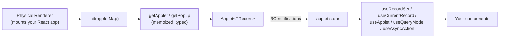

# Siebel Connect

A fully-typed, **React-first** bridge to Siebel Open UI's Business Component (BC) layer.

`siebel-connect` is a typed rewrite of `@ideaportriga/nexus-bridge` + `@ideaportriga/nexus-factory`. It
keeps the original runtime behaviour and adds:

- **Strong types end-to-end.** An augmentable `AppletRegistry` drives inference, so
  `getApplet('accountList')` returns a typed `Applet<Account>`, not `any`.
- **React hooks** with minimal re-renders, backed by Siebel's own BC notifications.
- **A typed error hierarchy**, a pluggable logger, and an in-memory mock Siebel for tests.

## How it fits together

Siebel's Presentation Model (PM) owns the data and pushes changes through BC notifications.
`siebel-connect` wraps that PM in typed applet classes, the factory hands you one instance per applet,
and the React adapter mirrors the applet's state into your components (it never fetches or caches data
of its own).

## Where to start

Read these in order the first time. Each builds on the previous one.

1. [Installation](/getting-started/installation/): add the package to your app.
2. [Siebel setup (the PR)](/getting-started/siebel-setup/): register your applets in the Physical
   Renderer and mount the React app.
3. [Typing your applets](/getting-started/typing/): declare each record shape once.
4. [Initialising the factory](/getting-started/init/): wire registry keys to Siebel applet names.
5. [Quick start](/getting-started/quick-start/): a complete end-to-end example.

Then work through the **[Guides](/guides/reading-data/)** for the everyday tasks: reading data,
creating and updating records, querying, MVGs, and pick applets.

## Entry points

| Import                          | Contents                                                          |
| ------------------------------- | ----------------------------------------------------------------- |
| `siebel-connect`                | Core applet classes + typed factory (framework-agnostic)          |
| `siebel-connect/react`          | React adapter hooks                                               |
| `siebel-connect/testing`        | In-memory Siebel mock harness                                     |
| `siebel-connect/siebel-globals` | Ambient `window.SiebelApp` / `SiebelJS` / `SiebelAppFacade` types |

## Reference

- **[React adapter](/react/hooks/)**: every hook, its signature, and its return shape.
- **[Core API](/core/factory/)**: the factory and the applet classes.
- **[Testing](/testing/)**: the in-memory mock Siebel harness.
- **[Migrating from Nexus](/migration/)**: the full `NexusFactory` to `siebel-connect` map.
