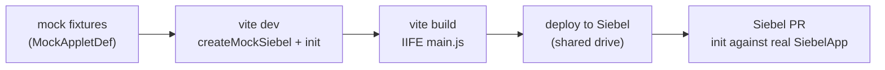

# Mock Siebel harness

`siebel-connect/testing` ships an in-memory Siebel so the bridge runs with **no live server**. It
installs `window.SiebelApp` / `SiebelJS` / `SiebelAppFacade`, exposes a fake Presentation Model (PM)
seeded from fixtures you write, and lets you drive BC notification batches. Use it for two things:

1. **Unit tests** (vitest), where each test seeds an applet and asserts the bridge's behaviour.
2. **Offline UI development**, where you run your React app in a plain browser against mock data,
   without a Siebel deployment.

The mock mirrors the real Open UI API **names and return shapes**: it implements the same ambient
`Siebel*` interfaces the bridge is typed against, so a passing test implies real-Siebel parity. The
surface is modelled from how the legacy bridge actually calls the PM, and grows as each port phase needs
new calls.

## `createMockSiebel`

```ts
import { createMockSiebel, type MockAppletDef } from 'siebel-connect/testing'

const accountList: MockAppletDef = {
  name: 'Account List Applet',
  isList: true,
  controls: {
    Name: { name: 'Name', fieldName: 'Name', isRequired: true },
    Location: { name: 'Location', fieldName: 'Location' },
  },
  records: [
    { Id: '1-A', Name: 'Acme', Location: 'NY' },
    { Id: '1-B', Name: 'Globex', Location: 'LA' },
  ],
}

const siebel = createMockSiebel({ applets: [accountList] })

const pm = siebel.getPM('Account List Applet')
pm.Get('GetRecordSet') // the seeded rows

siebel.destroy() // remove the globals, restoring whatever was there before
```

Always `destroy()` between tests (e.g. in `afterEach`) so the globals do not leak across tests.

## Where your mock data lives

Your mock data is the array of **`MockAppletDef` fixtures** you pass to `createMockSiebel`. One fixture
describes one Siebel applet: its name, whether it is a list, its controls, and its seed records.

A `MockAppletDef` accepts (only `name` is required):

| Field | Meaning |
| ----- | ------- |
| `name` | The Siebel applet name (must match the name you pass to `init`). |
| `isList` | `true` for a list applet, omit for a form. |
| `controls` | Map of control name to `MockControlDef` (`fieldName`, `uiType`, `isRequired`, ...). |
| `records` | The rows `Get('GetRecordSet')` returns (your typed record shape). |
| `rawRecords` | Rows for `Get('GetRawRecordSet')`; defaults to `records`. |
| `selection` | The selected index; defaults to `0` when there are rows. |
| `inQueryMode` | Seed query mode on. |
| `insertPending` / `commitPending` | Drive `calculateCurrentRecordState`. |
| `executeMethod` | Override `ExecuteMethod(name, args)` for custom behaviour. |

Keep fixtures in their own module so tests and offline dev share one source of truth. A common layout:

```
src/
  mocks/
    fixtures.ts     // exported MockAppletDef objects (your mock data)
    siebel.ts       // createMockSiebel({ applets }) wiring for offline dev
```

```ts
// src/mocks/fixtures.ts
import type { MockAppletDef } from 'siebel-connect/testing'

export const accountListFixture: MockAppletDef = {
  name: 'Account List Applet',
  isList: true,
  controls: {
    Name: { name: 'Name', fieldName: 'Name' },
    Location: { name: 'Location', fieldName: 'Location' },
  },
  records: [
    { Id: '1-A', Name: 'Acme', Location: 'New York' },
    { Id: '1-B', Name: 'Globex', Location: 'London' },
  ],
}

export const accountFormFixture: MockAppletDef = {
  name: 'Account Entry Applet',
  controls: {
    Name: { name: 'Name', fieldName: 'Name' },
    Location: { name: 'Location', fieldName: 'Location' },
  },
  records: [{ Id: '1-A', Name: 'Acme', Location: 'New York' }],
}
```

The applet `name` in each fixture must match the Siebel applet name your
[`appletMap`](./getting-started/init.md) points at, so the same `getApplet('accountList')` resolves
against the mock in dev and against real Siebel in production.

## Using the mock in unit tests

Seed the applets the test needs, drive a notification batch to simulate Siebel pushing a change, and
assert. Tear down in `afterEach`.

```ts
import { afterEach, expect, test } from 'vitest'
import { createMockSiebel } from 'siebel-connect/testing'
import { init, getApplet } from 'siebel-connect'
import { accountListFixture } from '../src/mocks/fixtures'

let siebel: ReturnType<typeof createMockSiebel>

afterEach(() => siebel?.destroy())

test('reads the seeded record set', () => {
  siebel = createMockSiebel({ applets: [accountListFixture] })
  init({ accountList: 'Account List Applet' })

  expect(getApplet('accountList').getRecordSet()).toHaveLength(2)

  // simulate Siebel adding a row, then assert subscribers saw it
  siebel.emitBatch('Account List Applet', [{ type: 'SWE_PROP_BC_NOTI_NEW_RECORD' }])
})
```

## Using the mock for offline UI development

The same harness lets you run your React app in a plain browser with no Siebel. The trick is to install
the mock **before** `init`, exactly where the [Physical Renderer](./getting-started/siebel-setup.md)
would normally have set up the real `window.SiebelApp`. Gate it behind a dev flag so it never ships.

```tsx
// src/main.tsx (dev entry, e.g. index.html in `vite dev`)
import { createRoot } from 'react-dom/client'
import { init } from 'siebel-connect'
import App from './App'

async function start() {
  if (import.meta.env.DEV) {
    const { createMockSiebel } = await import('siebel-connect/testing')
    const { accountListFixture, accountFormFixture } = await import('./mocks/fixtures')
    createMockSiebel({ applets: [accountListFixture, accountFormFixture] })
  }

  init({
    accountList: 'Account List Applet',
    accountForm: 'Account Entry Applet',
  })

  createRoot(document.getElementById('root')!).render(<App />)
}

start()
```

Now `vite dev` renders the real components against mock data, and the hooks behave exactly as in Siebel.
To exercise reactivity, fire a batch from a dev control or the console:

```ts
// anywhere you keep the mock handle in dev
siebel.emitBatch('Account List Applet', [{ type: 'SWE_PROP_BC_NOTI_NEW_ACTIVE_ROW' }])
```

> The `siebel-connect/testing` import is dynamic and DEV-gated, so your production bundle never includes
> the mock. The production path is the [PR entry point](./getting-started/siebel-setup.md), which calls
> `init` against the real `window.SiebelApp` instead.

## Where the mock fits the dev to deploy flow



Same fixtures power tests and local dev; the build produces the IIFE; the deploy step ships it to the
Siebel server. See [Building & deploying](./guides/deployment.md) for the build and the automated
shared-drive deploy.

## The mock PM

`getPM(name)` returns a `MockPresentationModel` implementing `SiebelPresentationModel`. Reads come from a
backing store seeded by the applet def:

| PM call | Returns |
| ------- | ------- |
| `Get('GetName')` | the applet name |
| `Get('GetListOfColumns')` | the controls map (list applet) or `undefined` (form) |
| `Get('ListOfColumns')` | columns keyed by name, each `{ control, isRequired }` |
| `Get('GetRecordSet')` / `Get('GetRawRecordSet')` | the seeded rows |
| `Get('IsInQueryMode')`, `GetRowListRowCount`, `GetNumRows`, `GetSelection` | seeded scalars |
| `ExecuteMethod(name, ...args)` | per-applet `executeMethod` override, else built-in defaults |

Test affordances beyond the Siebel surface: `set(key, value)`, `setActiveControl(control)`, and
`fireBinding(name, ...args)`.

## Driving notifications

The bridge's subscription engine listens for a BC notification **batch**: `BEGIN`, then one or more
notifications, then `END` (subscribers fire at `END` when at least one notification was accepted).

```ts
// fire one notification to every handler attached for its type
pm.emit({ type: 'SWE_PROP_BC_NOTI_STATE_CHANGED', props: { state: 'cp' } })

// or a whole batch (BEGIN -> ... -> END) on an applet by name
siebel.emitBatch('Account List Applet', [{ type: 'SWE_PROP_BC_NOTI_NEW_RECORD' }])
```

`props` become the handler's `propSet` (`propSet.GetProperty('state')`). Build a standalone property set
with `makePropertySet({ ... }, type)`.

> Constants are identity-mapped: `constants.get('SWE_PROP_BC_NOTI_END')` returns the key itself. Real
> Siebel returns an opaque code; the bridge only needs the value to be consistent between the attach and
> dispatch sides, which identity mapping guarantees. The keys the bridge depends on are listed in
> `KNOWN_CONSTANTS`.

## Popups and services

For popup-driven flows, `setCurrPopups([...])` drives `PopupController.IsPopupOpen`, `getPopupPM()`
returns the shared popup PM, and `fireEvent(name, ...)` replays a Siebel `EventManager` event. To test
`getMVF`, pass a `services` map so `S_App.GetService('Nexus BS')` resolves:

```ts
const siebel = createMockSiebel({
  applets: [accountListFixture],
  services: { 'Nexus BS': myFakeBusinessService },
})
```
